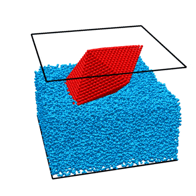
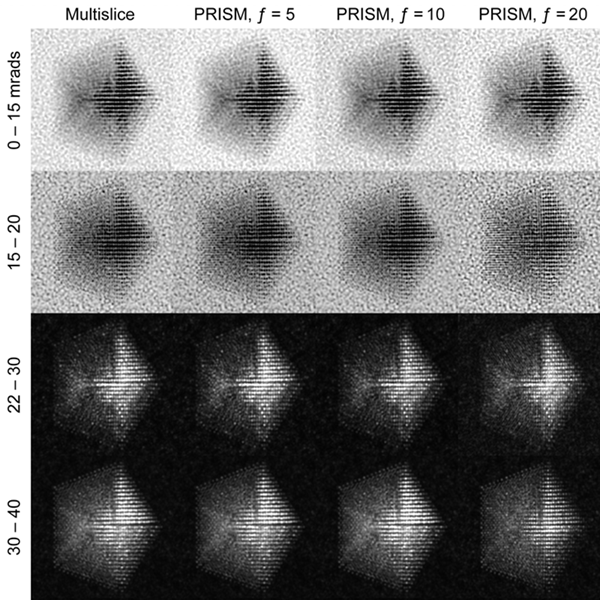

# Prismatic Tutorial (Under Construction)   
---
*This tutorial is a work in progress and will be finished in the very near future*

## Table of Contents  
- [Examples](#examples)
- [Prismatic GUI simulation of decahedral NP](#tutorialdeca)
- [PyPrismatic: Using Prismatic through Python](#pyprismatic)  
&nbsp;&nbsp;&nbsp;&nbsp;&nbsp;  - [Metadata Parameters](#metadata)

## Examples

Within the source code of `Prismatic` is an "examples" folder that contains some example scripts of how one might run simulations using *Prismatic*. There is a mixture of Python examples use `PyPrismatic` and bash shell scripts using `prismatic`. Both tools are accessing the exact same underlying code -- they just provide different entry points. Use whatever you feel most comfortable with.

## Prismatic GUI simulation of decahedral NP

[Issues with this tutorial?  Email Colin at clophus@lbl.gov]

In this example we will walk you through the entire procedure for generating a STEM simulation of a decahedral nanoparticle. This simulation should match the result shown in the PRISM algorithm paper: [DOI:10.1186/s40679-017-0046-1](http://dx.doi.org/10.1186/s40679-017-0046-1), specifically Figures 3, 4 and 5. Below is an overview of the sample we will construct, and an example of image simulations generated from both the multislice method, and the PRISM algorithm with varying degrees of accuracy.

|  |  | 
|:---:|:---:|
| Atomic model of a decahedral nanoparticle resting upon an amorphous carbon substrate. | STEM annular bright field and annular dark field image simulations taken from Figure 4 of the [PRISM algorithm paper](http://dx.doi.org/10.1186/s40679-017-0046-1). |

The steps we will follow for this tutorial are:

1. Download atomic coordinate files.
2. Construct unified atomic model in Matlab.
3. Export coordinates in .xyz format for `Prismatic`.
4. Set up simulation parameters.
5. Test PRISM vs Multislice accuracy.
6. Run PRISM simulation, save output as .mrc.
7. Generate final image outputs.

### 1 - Download atomic coordinate files.

To simulate a realistic nanoparticle sample, we require two sets of atomic coordinates. The first is (obviously) the nanoparticle itself. We have chosen to simulate a defected nanoparticle, as this is a more realistic sample with more interesting features than the ideal nanoparticles often used in atomic model simulations. Such a structure is available for download from a page on the [Miao group website](http://www.physics.ucla.edu/research/imaging/dislocations/index.html). I've saved the coordinates as a .csv file [here](data/atoms_deca_cartesian_x_y_z_ID.csv). Each row corresponds to an atom, and the four columns are [x y z ID] where (x,y,z) are the 3D position in Angstroms, and ID is the atomic Z number of the atoms. In this case I've used 78 for platinum, but this can be changed to any atomic species for this example simulation.

This nanoparticle has a defected decahedral geometry; a type of multiply-twinned particle composed of 5 tetrahedral crystalline FCC segments (see [Wikipedia/Pentagonal_bipyramid](https://en.wikipedia.org/wiki/Pentagonal_bipyramid) for an stretched image of the shape). The 5 boundaries between these 5 segments are FCC crystalline twins. In this decahedral particle, 2 of the 5 segments contain defects - stacking faults and dislocations.  This makes the particle interesting from a imaging standpoint, since the symmetry breaking of the defects leads to complex diffraction signals even when viewing down crystallographic axes.

The second set of coordinates is often overlooked in image simulations - we need a block of atoms representing a realistic substrate.  A substrate is an unavoidable part of electron microscopy experiments, since samples stubbornly refuse to float in free space in the path of the electron beam. In order to affect the experiment as little as possible, we typically utilize very thin, low atomic number substrates, usually ultra-thin amorphous carbon supports. We could just randomly generate coordinates and then delete the atoms that are too close together, but the literature contains better examples. Let's use the amorphous carbon blocks given in [this paper](http://dx.doi.org/10.1063/1.4831669) by Ricolleau et al. These authors have (generously) made some of their realistic amorphous carbon structures available for download. In case you don't have access I have again saved the coordinates as a .csv file [here](data/atoms_amorCarbon_50nmCube_x_y_z_ID.csv),

We now have all of the atomic coordinates required to build our simulation "scene."

### 2. Construct unified atomic model in Matlab.
[In Progress]

### 3. Export coordinates in .xyz format for `Prismatic`.
[In Progress]

### 4. Set up simulation parameters.
[In Progress]

### 5. Test PRISM vs Multislice accuracy.
[In Progress]

### 6. Run PRISM simulation, save output as .mrc.
[In Progress]

### 7. Generate final image outputs.
[In Progress]

## PyPrismatic: Using Prismatic through Python  

*Instructions for installing `PyPrismatic` may be found at [here](www.prism-em.com/installation/)*

To run a simulation with `PyPrismatic`, you simple create a `Metadata` object, adjust the parameters, and then execute the calculation with the `go` method. A list of adjustable parameters is [below](#metadata). These parameters can either be set with keyword arguments when constructing the `Metadata` object, or directly with the `.` operator. A simple example script utilizing both methods of setting parameters follows where the hypothetical input atomic coordinate information exists in the file "myInput.XYZ", the electron energy is set to 100 keV, and a 3x3x3 unit cell tiling is desired. The remaining parameters will be set to the default values (the `toString()` method can be used to print out all of the current settings).

~~~ python
import pyprismatic as pr
meta = pr.Metadata(filenameAtoms="myInput.XYZ", E0=100e3)
meta.tileX = meta.tileY = meta.tileZ = 3
meta.go()
~~~

## List of Metadata parameters

**interpolationFactorX** : PRISM interpolation factor in x-direction  
**interpolationFactorY** : PRISM interpolation factor in y-direction  
**filenameAtoms** : filename containing input atom information in XYZ format (see [here](http://prism-em.com/about/) for more details)  
**filenameOutput** : filename in which to save the 3D output. Also serves as base filename for 2D and 4D outputs if used  
**realspacePixelSizeX** : size of pixel size in X for probe/potential arrays  
**realspacePixelSizeY** : size of pixel size in Y for probe/potential arrays  
**potBound** : limiting radius within which to compute projected potentials from the center of each atom (in Angstroms)  
**numFP** : number of frozen phonon configurations to average over  
**sliceThickness** : thickness of potential slices (in Angstroms)  
**cellDimX** : unit cell dimension X (in Angstroms)  
**cellDimY** : unit cell dimension Y (in Angstroms)  
**cellDimZ** : unit cell dimension Z (in Angstroms)  
**tileX** : number of unit cells to tile in X direction  
**tileY** : number of unit cells to tile in Y direction  
**tileZ** : number of unit cells to tile in Z direction  
**E0** : electron beam energy (in eV)  
alphaBeamMax** : the maximum probe angle to consider (in mrad)  
**numGPUs** : number of GPUs to use. A runtime check is performed to check how many are actually available, and the minimum of these two numbers is used   
**numStreamsPerGPU** : number of CUDA streams to use per GPU  
**numThreads** : number of CPU worker threads to use  
**batchSizeTargetCPU** : desired batch size for CPU FFTs  
**batchSizeTargetGPU** : desired batch size for GPU FFTs  
**earlyCPUStopCount** : the WorkDispatcher will cease providing work to CPU workers earlyCPUStopCount jobs from the end. This is to prevent the program waiting for slower CPU workers to complete  
**probeStepX** : step size of the probe in X direction (in Angstroms)  
**probeStepY** : step size of the probe in Y direction (in Angstroms)  
**probeDefocus** : probe defocus (in Angstroms)  
**C3** : microscope C3 (in Angstroms)    
**probeSemiangle** : probe convergence semi-angle (in mrad)  
**detectorAngleStep** : angular step size for detector integration bins (in mrad)  
**probeXtilt** : (in Angstroms)  
**probeYtilt** : (in Angstroms)  
**scanWindowXMin** : lower X size of the window to scan the probe (in fractional coordinates)  
**scanWindowXMax** : upper X size of the window to scan the probe (in fractional coordinates)  
**scanWindowYMin** : lower Y size of the window to scan the probe (in fractional coordinates)  
**scanWindowYMax** : upper Y size of the window to scan the probe (in fractional coordinates)  
**randomSeed** : number to use for random seeding of thermal effects  
**algorithm** : simulation algorithm to use, "prism" or "multislice"  
**includeThermalEffects** : true/false to apply random thermal displacements (Debye-Waller effect)  
**alsoDoCPUWork** : true/false to spawn CPU workers in addition to GPU workers  
**save2DOutput** : save the 2D STEM image integrated between integrationAngleMin and integrationAngleMax  
**save3DOutput** : true/false Also save the 3D output at the detector for each probe (3D output mode)  
**save4DOutput** : true/false Also save the 4D output at the detector for each probe (4D output mode)  
**integrationAngleMin** : (in mrad)  
**integrationAngleMax** : (in mrad)  
**transferMode** : memory model to use, either "streaming", "singlexfer", or "auto"  
